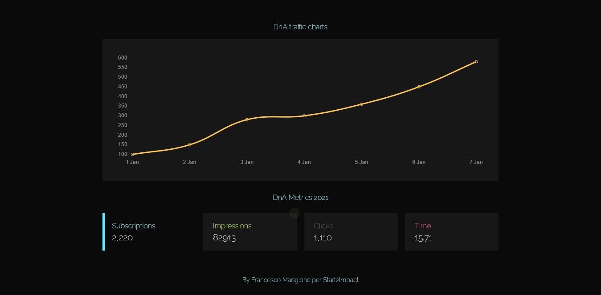

### DnA Metric</br>

Show DnA metrics with labels and chart.

## Table of Contents

[General info](#general-info)</br>
[Technologies](#technologies)</br>
[Setup](#setup)</br>

### General info

This app has been developed with Vite, Vue.js 3, Pinia for state management, vue Chartjs, tailwind, axios and countUp.

- Chart.
- Filter data.
- Upgrade impression value.



### Technologies

- [Vue.js](https://vuejs.org/)
- [Javascript](https://developer.mozilla.org/en-US/docs/Web/JavaScript?retiredLocale=it)
- [Vite](https://vitejs.dev/guide/)
- [Pinia](https://pinia.vuejs.org/)
- [Vue Chartjs](https://vue-chartjs.org/)
- [Tailwind](https://tailwindcss.com/)
- [Axios](https://www.npmjs.com/package/axios)
- [CountUp](https://www.npmjs.com/package/vue-countup-v3)

### Setup

Download [Node](https://nodejs.org/en/) and installed it on your operating system like windows or mac.

1. Clone the repository on local server:

   ```sh
   git clone https://github.com/francescoup/
   ```

2. Install NPM packages:

   ```sh
   npm install
   ```

3. Build from source:

   ```sh
   npm run build
   ```

4. Run the live server:
   git

   ```sh
   npm run dev
   ```

   ```

   ```

## License

Distributed under the MIT License.

## Links

You can see the app at the following link:

Live Site: [DnA Metric Vue.js](https://vue2-final.netlify.app/)</br>

## Contact

Contact me on: [f.mangione@live.com](mailto:f.mangione@live.com)  
Linkedin profile here: [https://www.linkedin.com/in/francesco-mangione/](https://www.linkedin.com/in/francesco-mangione/)
